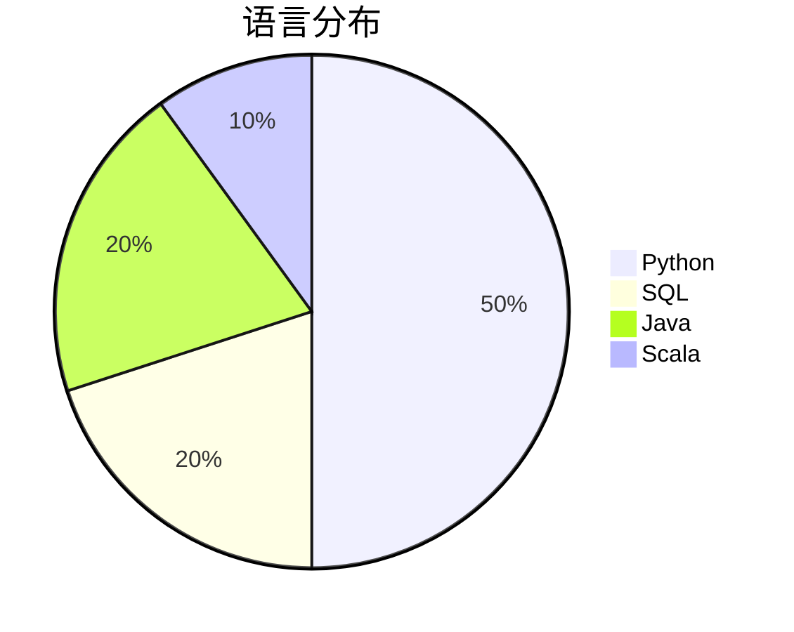

[image_0]: https://pfst.cf2.poecdn.net/base/image/de5bf3f8121199834d4df5b1f15c72e06702d4b71047a10544029346580b811c?pmaid=423238389
[image_1]: https://pfst.cf2.poecdn.net/base/image/74d82063026d0e40754b464abf1d1de1e8189841ebbe9cb15e6b72e9a3b40ec0?pmaid=423238395
[image_2]: https://pfst.cf2.poecdn.net/base/image/f2ce09d8d47c27ddca19e5fafdadff6276f84295326bfcf53e3e47750326adad?pmaid=423238399
[image_3]: https://pfst.cf2.poecdn.net/base/image/401cfd57966969edd27ee815d94bb443f6e94af4626bfdc97a51d74b283bb7e5?pmaid=423238401
[image_4]: https://pfst.cf2.poecdn.net/base/image/56163b5ecc8cdc0566a5d7d9bf0648342e81cfc48eb729dcf299e1c1217e5e3c?pmaid=423238410
[image_5]: https://pfst.cf2.poecdn.net/base/image/cb4478f5fd9d884d273e31e4f55e5c5f053f6a1437eff0b68eef231a0c9ce0a9?pmaid=423238416
[image_6]: https://pfst.cf2.poecdn.net/base/image/888eef149d55f28dc9a030fab8c83e6aab65b6cba347f35ab136649eae109ab1?pmaid=423238421
[image_7]: https://pfst.cf2.poecdn.net/base/image/82a3346efd15d971e6f8bdcf0616089214c06776ad7592d33e457cbd86744e3d?pmaid=423238430
[image_8]: https://pfst.cf2.poecdn.net/base/image/1b6d13cbca12ae88bf7accacb5992e2c0f53c7f57d98030380a093d0965bae7e?pmaid=423238440
[image_9]: https://pfst.cf2.poecdn.net/base/image/8d9c0894a189976a60c63d6ab3d254bdd3a5232afd27460daeee7067a199cd33?pmaid=423238449
[image_10]: https://pfst.cf2.poecdn.net/base/image/3784c70e992690e704f05f92ee048e941b1bed14b36b05bd8e803fa4717e22c1?pmaid=423238451
[image_11]: https://pfst.cf2.poecdn.net/base/image/48649657ebc3f8dbb00870c3ad5e068849e8c27c8d5893b16c0dff7a715b68e8?pmaid=423238458
[image_12]: https://pfst.cf2.poecdn.net/base/image/8a5ca6246a8858e392009c385deecd042a1604d26e0b1e2df3243e51497cc09c?pmaid=423238476
[image_13]: https://pfst.cf2.poecdn.net/base/image/64b30c18e6c2f5a5ff9c5fe231a10c51f57723184aed75cfdcab52804663089e?pmaid=423238483
[image_14]: https://pfst.cf2.poecdn.net/base/image/097857deb21621329a559f74d49ebe2712213990d22a211fa39e220e125816df?pmaid=423238488
[image_15]: https://pfst.cf2.poecdn.net/base/image/f69ce65420deac3bdd4fe29a9e5502068f464bc517f732d05b2052bdb7cc0a89?pmaid=423238492
[image_16]: https://pfst.cf2.poecdn.net/base/image/815dc7af01fde75c91c1bcff3b0d3708bfd7e0465fe7699cf46acb3fc902f883?pmaid=423238512
[image_17]: https://pfst.cf2.poecdn.net/base/image/5c0ef9cddaa0378158548aa38c8e5703769b4e03d18aa65d348237be66b10ce0?pmaid=423238523
[image_18]: https://pfst.cf2.poecdn.net/base/image/e2e05bba90e02b3636c3f992122f92ba6eddb82d97941f14c26fef8f04bda8d0?pmaid=423238535
[image_19]: https://pfst.cf2.poecdn.net/base/image/f149f912ce0d06a3dc27045572883ac4703b228db111b000854253456bb73f20?pmaid=423238542
[image_20]: https://pfst.cf2.poecdn.net/base/image/1fa1756d133a18198130bed2815dae2927f0cc1db429d384d9fb15bfa7febb46?pmaid=423238554
[image_21]: https://pfst.cf2.poecdn.net/base/image/9c8f2c1df167752dba4f5ea0561a63b94dd06a228d5954f2490fc0c118473ee1?pmaid=423238569
[image_23]: https://pfst.cf2.poecdn.net/base/image/f38dde1f4e07d87c7d2782a150280aa898dbdf128e4b6858f4b9998436b2d76e?pmaid=423238619
[image_24]: https://pfst.cf2.poecdn.net/base/image/ebadf40e08d8b88460734a6a69de60a893bb1d6274a9aaa23008dac835ca4643?pmaid=423238671
[image_25]: https://pfst.cf2.poecdn.net/base/image/5183ec17655e6b196ea1fe796e65605611f74b6a427711c5dbc641cc4d980d11?pmaid=423238677
[image_26]: https://pfst.cf2.poecdn.net/base/image/935945fda30f56d535a8869bc64da1bc3902c3420cbb28ca9b3f0b6c16f5177c?pmaid=423238682
[image_27]: https://pfst.cf2.poecdn.net/base/image/13818745989715732870fce0924052da8360b44d3466c5c7ccfe8f0fefd3b4dc?pmaid=423238695
[image_28]: https://pfst.cf2.poecdn.net/base/image/e2e3339eabba2b7e86e751e018c75ec3171a920e6101ddb6ee7c00eddcb853bb?pmaid=423238715


```markdown
<div align="center">
  <h1>🧠 AI开发者 | 🚀 开源贡献者 | 🔍 技术探索者</h1>
  <p>
    
    
    
  </p>
</div>

---

## 📊 开发者画像
```diff
+ 核心领域：大模型开发 | 多智能体系统 | 语言技术栈
! 技术理念：简洁设计 × 高效工具链 × 可复现性
# 2025目标：多模态模型落地 × 开源项目协作 × 技术影响力提升
```

<p align="center">
  
  
  
</p>

---

## 🧩 技术栈矩阵



<div align="center">
  
</div>

| 领域           | 技术栈                                                                 |
|----------------|------------------------------------------------------------------------|
| 🧠 AI 开发     | PyTorch, TensorFlow, HuggingFace, LangChain, OpenAI API               |
| 🚀 后端开发    | Spring Boot, Scala, RESTful API, GraphQL, Kafka                       |
| 🛠️ DevOps     | Docker, Kubernetes, GitHub Actions, AWS, Prometheus                   |
| 📊 数据处理    | SQL, Pandas, Spark, Dask, BigQuery                                    |

---

## 🏗️ 精选项目

| 项目 | 技术标签 | 状态 | 描述 |
|------|----------|------|------|
| [**llm-agent-dialogue**](https://github.com/weiiWill/llm-agent-dialogue-system) | ![Python][image_0] ![LangChain][image_1] ![OpenAI][image_2] |  | 多模型协作的对话框架，支持自定义工具扩展 |
| [**rustWill**](https://github.com/weiiWill/rustWill) | ![Rust][image_4] ![WASM][image_5]  |  | 现代化系统工具集，强调内存安全和并发 |
| [**Text_corrector**](https://github.com/weiiWill/Text_corrector) |    |  | 基于深度学习的文本纠错与增强工具 |
| [**Model-Optimizer**](https://github.com/weiiWill/Model-Optimizer) |    |  | 大模型压缩与推理优化工具链 |

---

## 🌐 开源足迹

### 🚀 近期贡献
#### Apache TVM
[![PR][image_16]](https://github.com/apache/tvm/pull/872) 优化LLM编译流程  
[![Issue][image_17]](https://github.com/apache/tvm/issues/1205) 多设备部署方案  
[![Commit][image_18]](https://github.com/apache/tvm/commit/a3f5c2) 修复CUDA后端问题

#### TrustRAG
[![PR][image_19]](https://github.com/trustrag/trustrag/pull/42) 增强检索模块  
[](https://github.com/trustrag/trustrag/wiki) 知识库文档维护  
[![Discussion][image_21]](https://github.com/trustrag/trustrag/discussions/18) 多模态检索方案

---

## 📈 开发节奏

```text
🕓 2025 年开发进展
Q1 ━━━━━━━━━━━━━━━╋━━━▶ 85% 
Q2 ━━━━━━━━━╋━━━━━━━━━▶ 60%
Q3 ━━━╋━━━━━━━━━━━━━━━▶ 25%
```

| 指标 | 值 | 趋势 |
|------|----|------|
| 🗓️ 活跃天数 | 2 | 📈 +100% |
| 📝 提交次数 | 4 | 📉 -20% |
| 🎯 季度目标 | 75% | [[Progress](https://progress-bar.dev/75)](https://github.com/weiiWill) |
| 🔥 代码热度 | 42 | [![Code Heat][image_23]](https://github.com/weiiWill) |

---

## 💬 技术观点
> "**多智能体协作**是LLM应用的未来方向，通过角色分工和记忆共享，  
> 可构建超越单模型的认知能力。——2025.7"

> "**Rust 在 AI 基础设施层**的优势日益凸显，其内存安全特性对关键系统开发至关重要。——2025.5"

---

## 📚 技术写作
- [多智能体系统的设计模式](https://example.com/blog/agent-design-patterns) 
- [Transformer 模型量化实战指南](https://example.com/blog/transformer-quantization)
- [Rust 高性能数据处理实践](https://example.com/blog/rust-data-processing)

---

<div align="center">
  
## 🤝 连接我

[![Email][image_24]](mailto:will.zhangweii@gmail.com)
[![GitHub][image_25]](https://github.com/weiiWill)
[![Twitter][image_26]](https://twitter.com/yourhandle)
[![LinkedIn][image_27]](https://linkedin.com/in/yourprofile)
[![Discord][image_28]](https://discordapp.com/users/yourid)

</div>

<div align="center">
  <sub>✨ 持续创新，创造价值 | 最后更新：2025年7月</sub>
</div>
